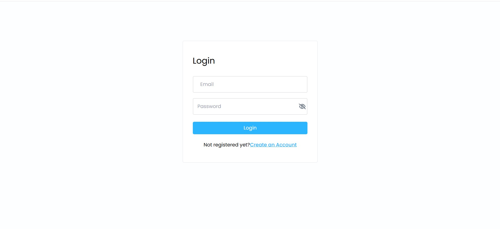
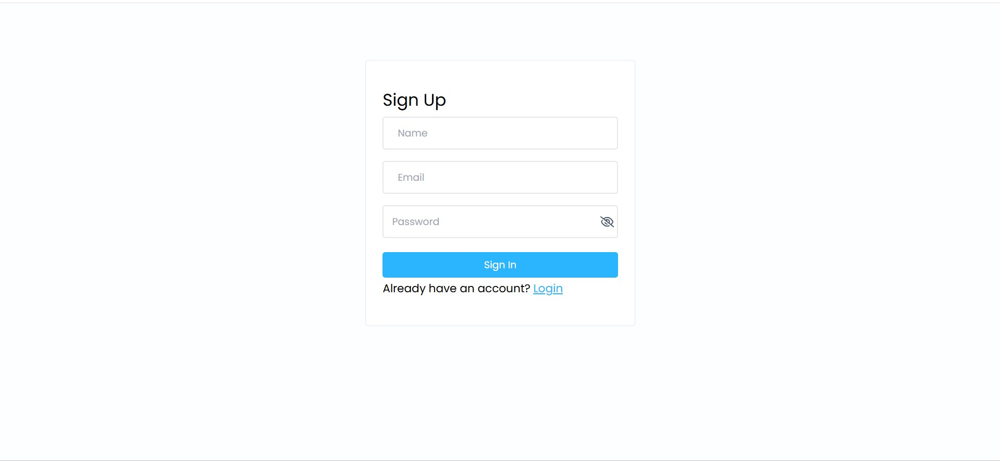
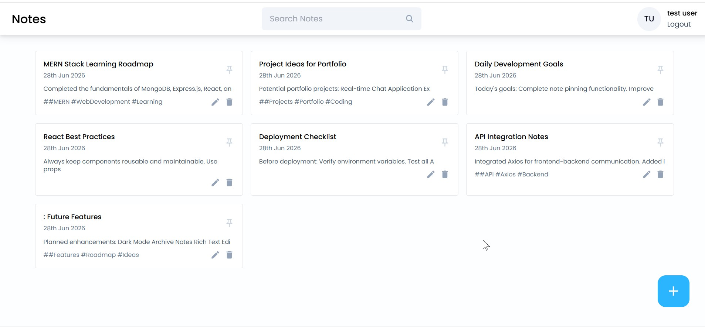
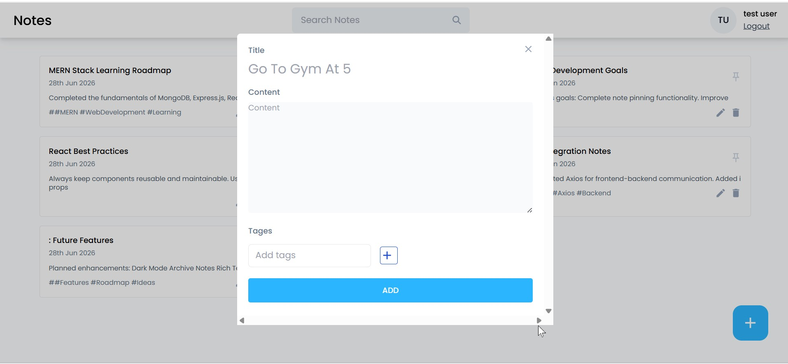
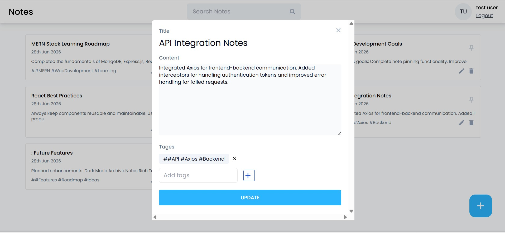
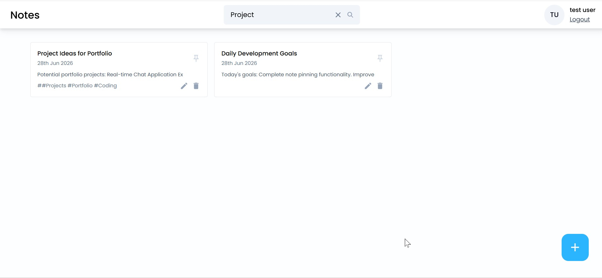

# 📝 MERN Notes App

A full-stack Notes Management Application built with the MERN Stack (MongoDB, Express.js, React.js, and Node.js). The application allows users to securely create, manage, search, update, pin, and delete personal notes.

## 🚀 Features

* 🔐 User Authentication (Sign Up & Login)
* 🔑 JWT-based Authorization
* 📝 Create New Notes
* ✏️ Edit Existing Notes
* 🗑️ Delete Notes
* 📌 Pin/Unpin Important Notes
* 🔍 Search Notes
* 🔒 Protected Routes
* 💾 Persistent Login Sessions
* 📱 Responsive User Interface
* 🔔 Toast Notifications for User Actions

---

## 🛠️ Tech Stack

### Frontend

* React.js
* React Router DOM
* Tailwind CSS
* Axios
* React Icons
* React Modal

### Backend

* Node.js
* Express.js
* MongoDB
* Mongoose
* JSON Web Tokens (JWT)
* bcrypt.js

---

## 📂 Project Structure

```bash
notes-app/
├── frontend/
│   ├── src/
│   └── public/
│
├── backend/
│   ├── controller/
│   ├── middleware/
│   ├── models/
│   ├── routes/
│   └── index.js
│
└── README.md
```

---

## ⚙️ Installation

### Clone the Repository

```bash
git clone https://github.com/yourusername/mern-notes-app.git
cd mern-notes-app
```

### Install Frontend Dependencies

```bash
cd frontend
npm install
```

### Install Backend Dependencies

```bash
cd ../backend
npm install
```

---

## 🔧 Environment Variables

Create a `.env` file inside the backend folder and add:

```env
PORT=8000
MONGO_URI=your_mongodb_connection_string
ACCESS_TOKEN_SECRET=your_secret_key
```

---

## ▶️ Running the Application

### Start Backend

```bash
cd backend
npm run dev
```

### Start Frontend

```bash
cd frontend
npm run dev
```

The application will run on:

* Frontend: `http://localhost:5173`
* Backend: `http://localhost:8000`

---

## 📸 Screenshots

### Login Page


---

### Sign Up Page



---

### Dashboard



---

### Add Note



---

### Update Note



---

### Search Notes



---

## 🔮 Future Enhancements

* Dark Mode
* Archive Notes
* Rich Text Editor
* Note Categories
* File Attachments
* User Profile Management

---

## 🤝 Contributing

Contributions, issues, and feature requests are welcome.

Feel free to fork this repository and submit a pull request.

---

## 👨‍💻 Author

**Ali Hassan**

* GitHub: https://github.com/Ali-eng-git


---

## ⭐ Show Your Support

If you found this project helpful, please consider giving it a ⭐ on GitHub.
